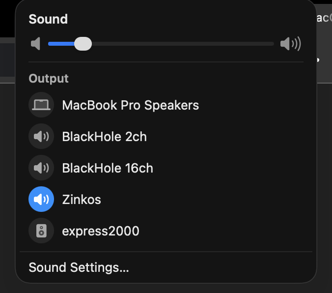
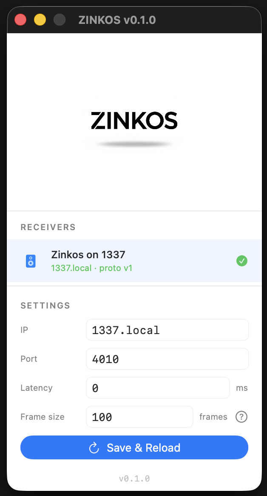
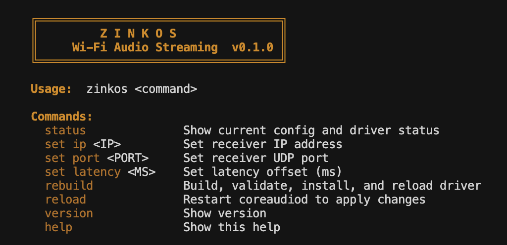

<p align="center">
  
</p>

<h3 align="center">Ultra low-latency Wi-Fi audio streaming</h3>

<p align="center">
  macOS CoreAudio driver + Linux receiver<br>
  ~9ms end-to-end (with tuning) &bull; Lossless PCM &bull; UDP
</p>

---

Select **Zinkos** as your sound output on macOS. Audio streams over your local network to a Linux receiver — a Raspberry Pi, an old laptop, any machine running ALSA. Connect a DAC or plug in speakers and you have a wireless audio endpoint with near-zero latency.

Watch films, YouTube, game, or video call — all in sync with your wirelessly connected speakers, no lip-sync issues. No proprietary hardware, no Apple ecosystem lock-in, no subscriptions. Just Wi-Fi and open source software.


<p align="center">
  
</p>


Zinkos appears as a native sound output in macOS — just select it like you would AirPods or built-in speakers. Receivers are discovered automatically via Bonjour/mDNS — open the setup app, pick your receiver, done. All system audio is captured and streamed instantly.

- **Free and open source** — MIT licensed, no accounts, no subscriptions, no cloud
- **No special hardware** — any Mac as sender, any Linux box as receiver (Raspberry Pi, old laptop, anything with ALSA)
- **Lossless** — uncompressed PCM, bit-perfect audio with no codec artifacts
- **Low latency** — fast enough for video, casual gaming, and everyday use
- **Lightweight** — the receiver is a single C binary under 300 lines, runs on a Pi Zero
- **Zero-config** — receivers advertise via mDNS, the macOS setup app discovers them automatically
- **Auto-appear/disappear** — Zinkos only shows up in Sound settings when a receiver is on the network
- **DHCP-safe** — stores mDNS hostnames, not IPs — survives DHCP lease changes

## How It Works

```
     MacBook              Wi-Fi           Linux (receiver)
┌────────────────┐     ┌──────────┐      ┌──────────────────┐
│ System audio   │     │   UDP    │      │ UDP recv thread  │
│      │         │     │ packets  │      │      │           │
│      ▼         │     │          │      │      ▼           │
│ CoreAudio ─────│─────│──────────│─────▶│ Ring buffer      │
│      │         │     │          │      │      │           │
│      ▼         │     └──────────┘      │      ▼           │
│ Zinkos driver  │                       │ Jitter buffer    │
│ (Rust engine)  │                       │      │           │
└────────────────┘                       │      ▼           │
                                         │ ALSA → DAC       │
                                         └──────────────────┘
```

## Latency Comparison

| | Latency | Quality | Hardware | Downsides |
|---|---|---|---|---|
| **Zinkos** | **~9ms (tuned) / ~25ms (default)** | **Lossless PCM** | **Standard Wi-Fi** | **Requires manual setup** |
| AirPlay 2 | ~2000ms | Lossless | Apple ecosystem | Unusable latency for video, Apple-only, no Linux receivers |
| Bluetooth A2DP | ~150ms | Lossy | BT adapter on both ends | Compressed audio, short range, pairs with one device |
| Snapcast | ~30–50ms | Lossless | Standard Wi-Fi | No native macOS output — requires piping audio manually |
| Dante (pro AV) | ~2ms | Lossless | Dedicated hardware both ends | Expensive licensing, proprietary hardware, not consumer-grade |

Zinkos sits between consumer wireless and pro AV gear — no special hardware or licensing needed. Default settings give ~25ms with comfortable margins; tuning the frame size and receiver buffer down gets you to ~8ms on a good network.

## Installation

### Prerequisites

**Mac (sender):**
- macOS (Apple Silicon or Intel)
- [Rust](https://rustup.rs/) — `curl --proto '=https' --tlsv1.2 -sSf https://sh.rustup.rs | sh`
- [CMake](https://cmake.org/) — `brew install cmake`
- Apple Developer certificate (free account works) — macOS requires signed audio plugins. Open Xcode → Settings → Accounts → add your Apple ID → Manage Certificates → create an Apple Development certificate. The build auto-detects it.

**Linux (receiver):**
- Any Linux machine (Raspberry Pi, old laptop, server — anything with ALSA)
- C compiler — `sudo pacman -S base-devel` (Arch) or `sudo apt install build-essential` (Debian/Ubuntu)
- ALSA dev headers — `sudo pacman -S alsa-lib` (Arch) or `sudo apt install libasound2-dev` (Debian/Ubuntu)
- Avahi (optional, for auto-discovery) — `sudo pacman -S avahi` (Arch) or `sudo apt install avahi-daemon` (Debian/Ubuntu)

### Mac (sender)

```bash
git clone https://github.com/hilmerx/zinkos.git
cd zinkos

# First-time build setup
mkdir build && cd build && cmake .. && cd ..

# Build, validate, install, and reload the driver
./scripts/zinkos rebuild

```

**Option A — Setup app (recommended):**

```bash
cd sender/app && swift build -c release
# Run the app — discovers receivers automatically via Bonjour
.build/release/Zinkos
```

Select your receiver from the list, hit Save & Reload, and pick "Zinkos" in System Settings → Sound → Output.

**Option B — CLI:**

```bash
zinkos set ip 192.168.1.87   # or a hostname like mypi.local
zinkos reload
```

### Linux (receiver)

```bash
git clone https://github.com/hilmerx/zinkos.git
cd zinkos/receiver/c

# Interactive installer — builds, lists audio devices, installs service
./zinkos-rx
```

The installer lists your ALSA devices and lets you pick one, then asks for latency tuning:

```
Available audio devices:

  1) hw:0,0  —  bcm2835 Headphones [bcm2835 Headphones]
  2) hw:1,0  —  USB Audio [USB Audio]

Select device [1-2]: 2

Latency tuning (press Enter for defaults):
  Start-fill buffer in ms [15]:
  ALSA period in frames [240]:
```

## Setup App

<p align="center">
  
</p>

The macOS setup app discovers receivers on your network via Bonjour/mDNS — no manual IP entry needed. Select a receiver, configure port and latency, and hit Save & Reload. The app stores mDNS hostnames (e.g. `mypi.local`) so it survives DHCP IP changes automatically.

```bash
cd sender/app && swift build -c release && .build/release/Zinkos
```

## CLI Tool

<p align="center">
  
</p>

```
zinkos status       # show config + driver health
zinkos set ip <IP>  # set receiver IP (or hostname like mypi.local)
zinkos set port <N> # set receiver port
zinkos rebuild      # compile, validate, install, reload
zinkos reload       # restart coreaudiod
```

## Dynamic Device Visibility

Zinkos only appears as a sound output when a receiver is actually available on the network. No more dead device in the menu when your Pi is off.

- **Bonjour discovery:** The driver browses for `_zinkos._udp` services. When a receiver is found, the device appears in Sound settings. When it disappears, the device is removed.
- **Grace period:** Brief WiFi hiccups won't yank the device — there's a 3-second grace period before unpublishing. If the receiver comes back within that window, nothing changes.
- **Manual IP override:** If you set a receiver IP via `zinkos set ip` or the setup app, the device always appears regardless of Bonjour. Backward compatible.
- **Clean disconnect:** If the receiver goes away while audio is playing, macOS switches to the default output automatically (same as unplugging a USB DAC).

## Architecture

| Component | Language | Role |
|-----------|----------|------|
| Driver shim | C++ | CoreAudio plugin interface, Bonjour discovery (Apple requires C/C++) |
| Engine | Rust | Ring buffer, packetizer, UDP sender, drift estimation |
| Receiver | C | UDP recv, jitter buffer, ALSA playback |
| Setup app | Swift | Bonjour discovery, config UI, coreaudiod reload |
| CLI | Bash | Config management, build, reload |

The engine is 100% testable without CoreAudio:

```bash
cargo test
```

## Latency Tuning

Two settings control end-to-end latency:

| Setting | Where | Default | Low-latency |
|---|---|---|---|
| **Frame size** (frames per packet) | Setup app or plist | 240 (~5ms) | 100 (~2ms) |
| **Start-fill** (receiver buffer) | `zinkos-rx` on receiver | 15ms | 3ms |

**Default settings (~25ms):** 240 frame size, 15ms start-fill. Rock-solid on any network.

**Tuned settings (~8ms):** 100 frame size, 3ms start-fill. Requires good Wi-Fi with low jitter.

The frame size is set in the macOS setup app and takes effect on Save & Reload — no driver rebuild needed. The receiver's start-fill and ALSA period are set during `zinkos-rx` and should match the sender's frame size for best results.

| Stage | Default | Tuned |
|---|---|---|
| CoreAudio IO buffer | ~2.7ms (128 frames) | ~2.7ms (128 frames) |
| Sender pacing | ~5ms | ~2ms |
| Network (Wi-Fi UDP) | ~1-2ms | ~1-2ms |
| Receiver start-fill | 15ms | 3ms |
| **Total** | **~25ms** | **~9ms** |

## Audio Format

Fixed across the entire pipeline — no negotiation, no codecs:

- **48,000 Hz** stereo
- **S16_LE** (16-bit signed little-endian PCM)
- **20-byte header** + PCM payload per UDP packet (size depends on frame size setting)
- **UDP port 4010** default (configurable via `zinkos set port <N>`)

## Roadmap

- Configurable sample rate (44.1kHz / 96kHz)
- Adaptive jitter buffer (auto-tune to network conditions)
- Clock drift compensation (sample insertion/dropping)
- ~~Bonjour/mDNS auto-discovery (no manual IP config)~~ Done
- ~~macOS Swift setup app~~ Done
- ~~Configurable frame size and receiver buffering~~ Done (~9ms achievable)
- ~~Dynamic device visibility (device appears/disappears based on receiver availability)~~ Done
- Multi-room / multi-receiver support
- Forward error correction (FEC) for lossy networks
- Pre-built signed installer (no Xcode or developer certificate needed)

## Documentation

- **[System Overview](docs/overview.md)** — Full architecture, glossary, latency breakdown, competitor comparison
- **[Latency Analysis](docs/latency-analysis.md)** — Stage-by-stage latency breakdown and receiver tuning guide

## License

[MIT](LICENSE)
